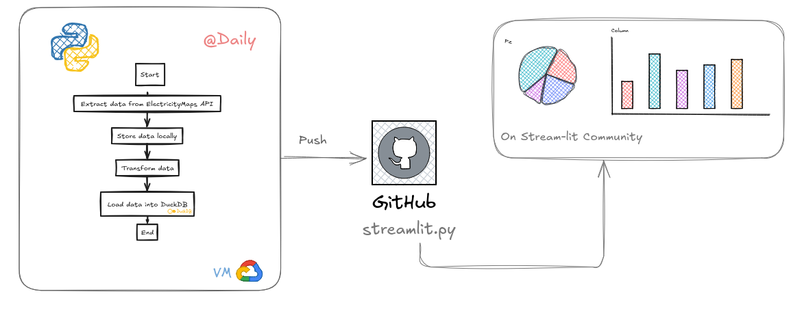

# ElectricityCarbonMonitoring 

This project aims to monitor daily how clean and low-carbon the electricity is in France and Germany. 
Terms and concepts used in the dashboards are explained in the "Info" section of each dashboard.

Access the live dashboards --> (https://electricitycarbonmonitoring-9vfxtjyxmawdurey6f9unm.streamlit.app/)

This project automates the extraction of data from the Electricity Maps API, processes the data using Python, and loads it into DuckDB (optimized for analytical queries). The pipeline runs daily on a Google Cloud VM and pushes updates to GitHub. Dashboards are hosted on Streamlit for community access.

